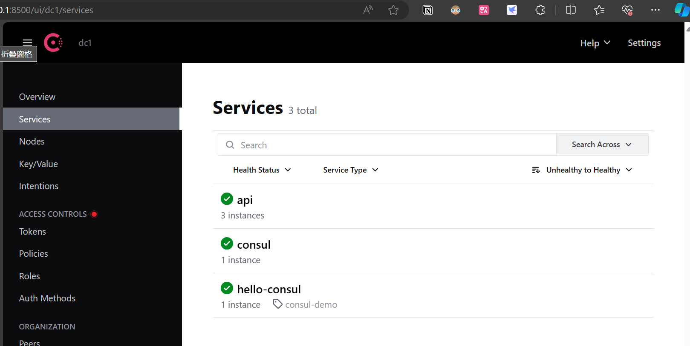
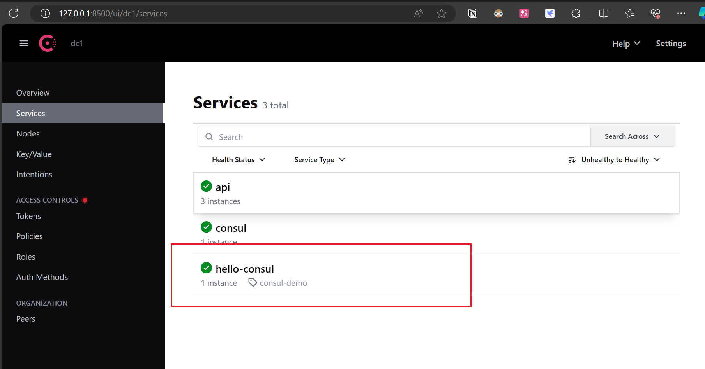
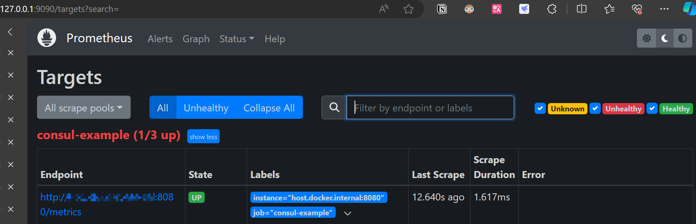

# services-discovery-consul-promethus

## 前言

在线上搜了资料，发现很多讲的都不全，要么是 在 Prometheus 的配置文件指定每个启动的服务，要么在启动 consul 的时候在 consul 的配置文件指定每个启动的服务，这样子每次新加服务就需要去改 Prometheus 或者 consul 的配置文件然后重新启动，非常不优雅，以下方式让 Prometheus 自动抓取在 consul 注册的服务

## 实现（implement）

- 服务注册 （registration of consul）
- 健康检查 （health check）
- 服务发现 （service discovery）
- 存储kv （storage of KV）
- 根据 k 获取 v （obtain the corresponding value according to key）
- prometheus自动抓取在 consul 服务的指标 （ automatically collect successful services registered with the consul service）

## 准备工作

- [安装consul ](https://developer.hashicorp.com/consul/install?product_intent=consul)
- [安装Prometheus](https://prometheus.io/download/)

我是用的 wsl2，用 homebrew 的方式安装的

### 启动consul

安装好了之后，可以用* ***consul agent -dev** 的命令启动 consul，-dev 代表的是开发模式，启动之后，如果你是在自己电脑本地启动的，就可以用 **127.0.0.1:8500** 进行访问了，如下图所示



### 启动 prometheus

启动 promethus 之前，我们修改它的配置文件，新建一个文件 promethus.yml，填充以下内容:

```yml
global:
  scrape_interval: 15s
  evaluation_interval: 15s

scrape_configs:
  - job_name: "consul-example"
    consul_sd_configs:
      - server: '127.0.0.1:8500'
    relabel_configs:
      - action: keep
        source_labels: [__meta_consul_service]
        regex: api
```

让 prometheus 在 consul 注册的服务中抓取

在该文件所处的目录下，运行 **prometheus --config.file=promethues.yml**

访问 127.0.0.1:9090,成功启动的界面效果


<br/>

### 启动我们的程序

[github 地址]([https://github.com/KingPuiWong/consul-sdk](https://github.com/KingPuiWong/services-discovery-consul-prometheus))

复制该项目，在项目目录下运行** go run . -listen=:8080**  **&**

后面这个 & 可加可不加，加的代表，你 Ctrl + c 终止后，它还是在后台运行的

你可以使用 **ps -ef | grep prometheus** 找到它的端口号，然后 **kill -9 port** 去终止它

这时候你可以在 consul 的 ui 上看到我们已经成功注册了这个服务



在 prometheus 的 ui 可以看到，prometheus 成功抓取到这个 target



在代码使用了 Gauge 的名称为h ost_temperature_celsius，我们可以在根据这个指标，绘制一个面板，并且由于在代码里设置了它的值为 39，所以这个面板显示这个指标的值就是 39


